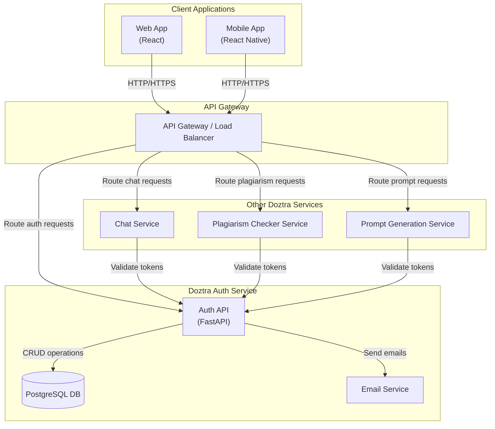
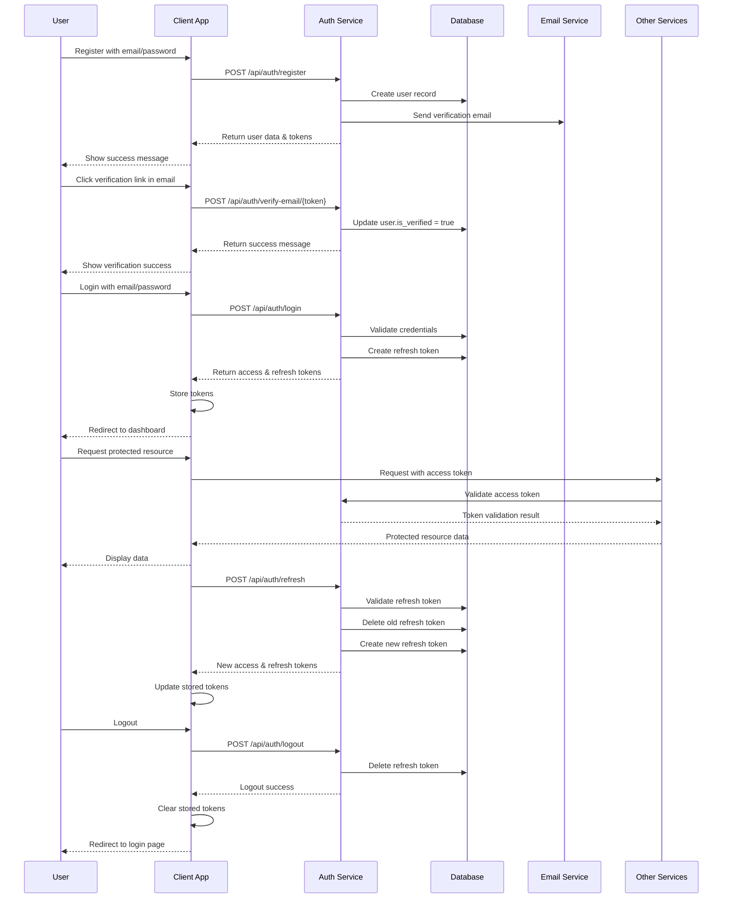
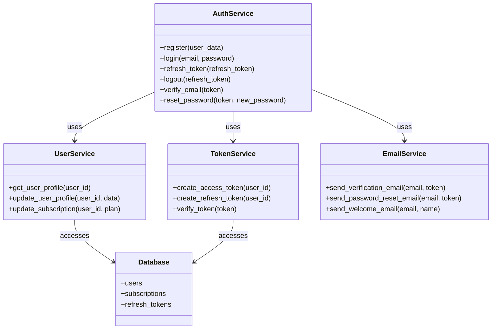
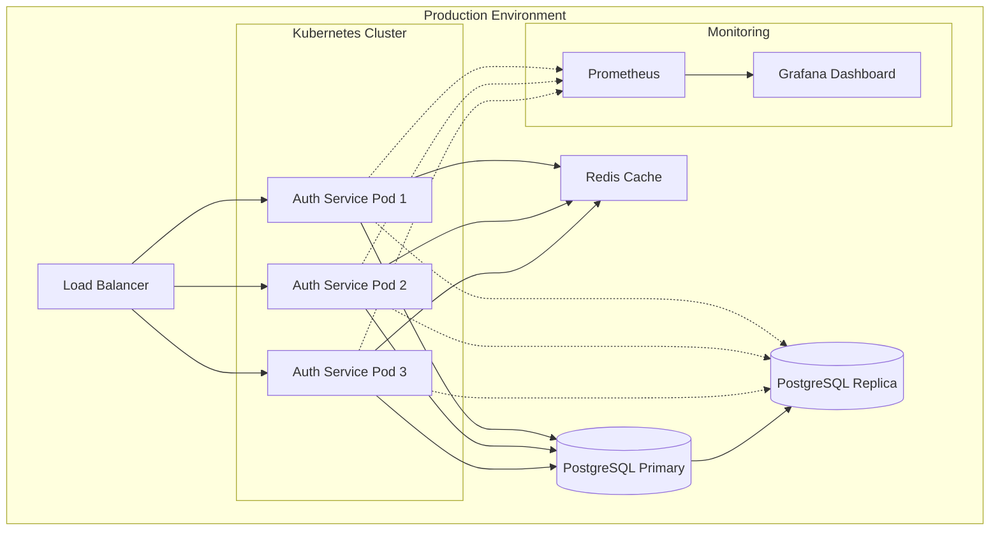

# Doztra Auth Service - Architecture Diagram

This document provides a visual representation of the Doztra Auth Service architecture and how it integrates with other components of the Doztra AI Platform.

## System Architecture

## Authentication Flow

## Component Diagram

## Deployment Architecture

## Security Measures

1. **Authentication**:
   - JWT tokens with short expiration
   - Refresh tokens with rotation
   - Password hashing using bcrypt

2. **Data Protection**:
   - HTTPS for all communications
   - Database encryption at rest
   - Sensitive data masking in logs

3. **Access Control**:
   - Role-based access control
   - Token validation for all protected endpoints
   - Rate limiting to prevent abuse

4. **Monitoring**:
   - Real-time security alerts
   - Failed authentication attempt monitoring
   - Regular security audits
