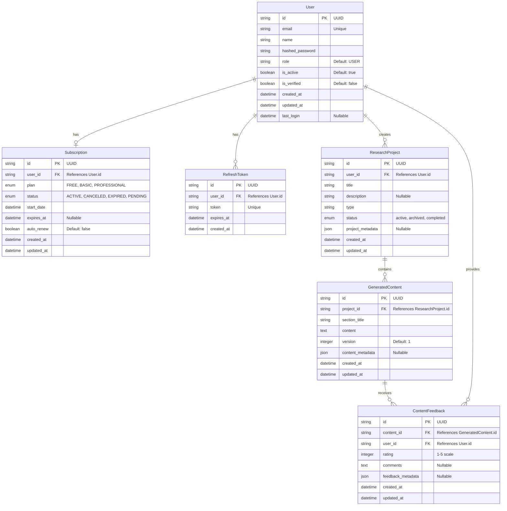

# Doztra Auth Service - Database Entity Relationship Diagram

This document provides a visual representation of the database schema for the Doztra Auth Service.

## Entity Relationship Diagram

## Relationships

1. **User to Subscription**: One-to-One (Optional)
   - A User may have one Subscription
   - A Subscription belongs to exactly one User

2. **User to RefreshToken**: One-to-Many
   - A User may have multiple RefreshTokens
   - Each RefreshToken belongs to exactly one User
   
3. **User to ResearchProject**: One-to-Many
   - A User may create multiple ResearchProjects
   - Each ResearchProject belongs to exactly one User
   
4. **ResearchProject to GeneratedContent**: One-to-Many
   - A ResearchProject may contain multiple GeneratedContent items
   - Each GeneratedContent belongs to exactly one ResearchProject
   
5. **GeneratedContent to ContentFeedback**: One-to-Many
   - A GeneratedContent item may receive multiple ContentFeedback items
   - Each ContentFeedback belongs to exactly one GeneratedContent item
   
6. **User to ContentFeedback**: One-to-Many
   - A User may provide multiple ContentFeedback items
   - Each ContentFeedback is provided by exactly one User

## Data Types

- **string**: Text data type (VARCHAR in PostgreSQL)
- **text**: Long text data type for storing large amounts of text
- **boolean**: Boolean data type (TRUE/FALSE)
- **datetime**: Date and time data type
- **enum**: Enumerated type with predefined values
- **integer**: Whole number data type
- **json**: JSON data type for storing structured data

## Constraints

- **PK**: Primary Key
- **FK**: Foreign Key
- **Unique**: Unique constraint
- **Default**: Default value
- **Nullable**: Can be NULL

## Additional Notes

- **User.id**: Primary identifier for users, generated as UUID
- **User.email**: Must be unique across all users
- **User.role**: Enum with values USER, ADMIN
- **Subscription.plan**: Enum with values FREE, BASIC, PROFESSIONAL
- **Subscription.status**: Enum with values ACTIVE, CANCELED, EXPIRED, PENDING
- **RefreshToken.token**: Unique token string for authentication
- **RefreshToken.expires_at**: Datetime when the token expires
- **ResearchProject.status**: Enum with values active, archived, completed
- **ResearchProject.project_metadata**: JSON field storing additional project metadata like academic_level, target_audience, etc.
- **GeneratedContent.version**: Integer tracking the version of the content, incremented on updates
- **GeneratedContent.content_metadata**: JSON field storing metadata about the content generation
- **ContentFeedback.rating**: Integer between 1-5 representing user rating
- **ContentFeedback.feedback_metadata**: JSON field storing additional feedback data

## Database Indexes

For optimal performance, the following indexes should be created:

1. User.email (unique index)
2. RefreshToken.token (unique index)
3. RefreshToken.user_id (for faster lookups)
4. Subscription.user_id (for faster lookups)
5. ResearchProject.user_id (for faster lookups)
6. GeneratedContent.project_id (for faster lookups)
7. GeneratedContent.section_title (for faster lookups by section)
8. ContentFeedback.content_id (for faster lookups)
9. ContentFeedback.user_id (for faster lookups)
